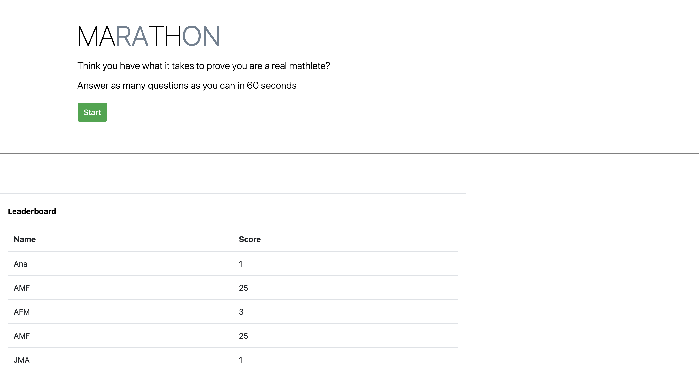

# Math Quiz Generator Read Me

## Summary

This website generates a 60 seconds addition quiz for users conditioning their brain to become mathematicians. As the user answers questions, a new one appears. When the user is wrong, 5 seconds are deducted from the timer. Once the timer reaches 0, the quiz ends and the user is prompted to enter their name or initials to be added to the leaderboard. 

## Site Picture



## Technologies Used
- Javascript - used to build a responsive website
- HTML and Bootstrap - used to create elements
- CSS - for styles elements on page
- Git - version control system to track changes to source code
- GitHub - hosts repository that can be deployed in GitHub pages

## Code Snippet

Within the questionGenerator, there is a piece of code that generates possible quiz options which I am particularly proud of. There is a while loop that semi-randomly creates answers and checks if the answer exists. Afterward, the real answer is added to the answers options after checking if it was randomly regenerated by change.

Question generator makes sure that a seemingly unlimited number of questions can be created.


```Code snippet
function questionGenerator(){
    var num1 = Math.floor(Math.random() * 50);
    var num2 = Math.floor(Math.random() * 25);
    var q = num1 + " + " + num2;
    var options = [];
    var answer = num1 + num2;
    var answerIndex;

    while (options.length < 4){
        var tempAns = num1 + Math.floor(Math.random() * Math.floor(25));
        if (options.indexOf(tempAns) === -1){
            options.push(tempAns);
        }
    }

    if (options.indexOf(answer) === -1){
        answerIndex = Math.floor(Math.random() * 4);
        options[answerIndex] = answer;
    }

    else if (options.indexOf(answer) > -1){
        answerIndex = options.indexOf(answer) ;
    }

    questionEl.textContent = q;
    buttonsArray[1].textContent = options[0];
    buttonsArray[2].textContent = options[1];
    buttonsArray[3].textContent = options[2];
    buttonsArray[4].textContent = options[3];
    correct = answerIndex;
}
```

## Author Links
- [LinkedIn](https://www.linkedin.com/in/ana-medrano-fernandez/)

- [GitHub](https://github.com/analoo)
